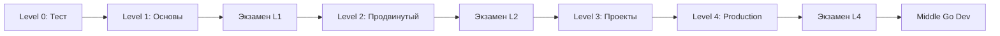
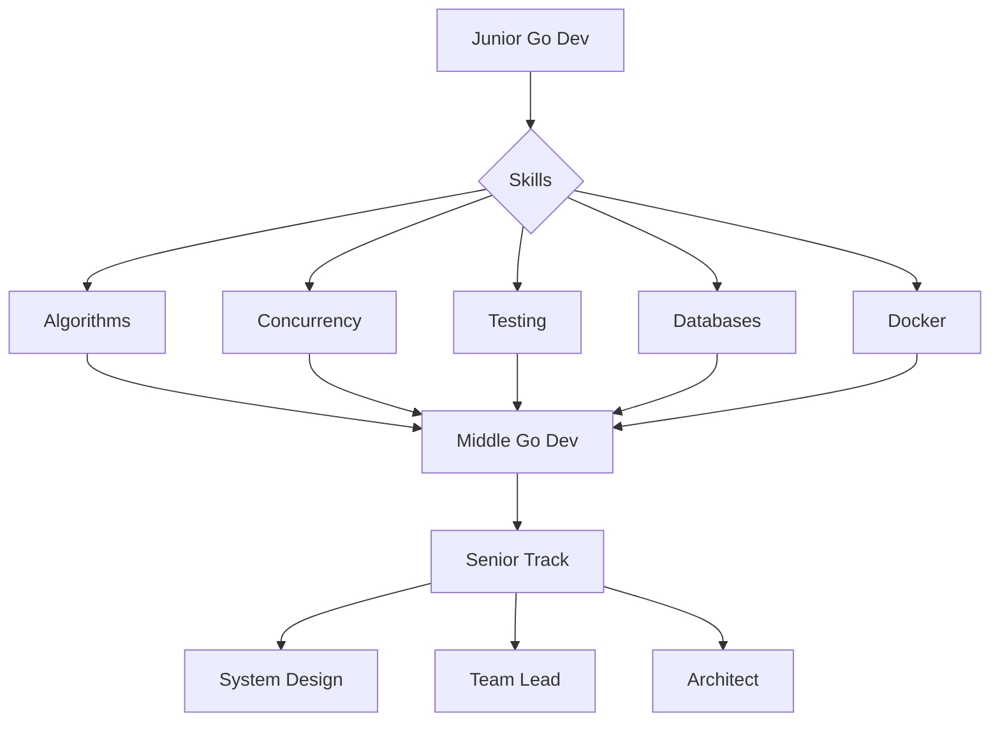

# 📚 Go Course Curriculum
> Детальная программа курса с чек-листами и целями обучения

## 🎯 Цель курса
Подготовка Middle Go Developer за 4 месяца через интенсивную практику и работу с production-ready технологиями.

---

## 📊 Структура программы


---

## 🚀 Level 0: Тестовое задание
**Длительность:** 2 недели  
**Цель:** Проверка базовых навыков и готовности к курсу

### 📋 Программа
- [ ] Разработка демонстрационного сервиса
- [ ] Интеграция с Apache Kafka
- [ ] Работа с PostgreSQL
- [ ] Реализация кэширования
- [ ] Контейнеризация с Docker
- [ ] Написание документации

### 🎓 Что вы освоите
- Базовая архитектура микросервисов
- Работа с брокерами сообщений
- Основы работы с БД в Go
- Паттерны кэширования
- Docker и docker-compose

### ✅ Критерии успеха
- Сервис запускается через docker-compose
- Обрабатывает сообщения из Kafka
- Корректно работает с БД
- Реализовано кэширование
- Код покрыт базовыми тестами

### 💡 Подсказки
```go
// Пример структуры проекта
/demo-service
├── cmd/
│   └── server/
│       └── main.go
├── internal/
│   ├── handler/
│   ├── service/
│   └── repository/
├── migrations/
├── docker-compose.yml
└── Dockerfile
```

---

## 📚 Level 1: Базовые возможности Go
**Длительность:** 2 недели  
**Задач:** 20+  
**Цель:** Освоение фундаментальных концепций Go

### 📋 Программа

#### Неделя 1: Основы языка
- [ ] **Структуры данных**
  - Массивы и слайсы
  - Мапы и их внутреннее устройство
  - Структуры и методы
  - Указатели и ссылки
- [ ] **Интерфейсы**
  - Явные и неявные интерфейсы
  - Пустой интерфейс
  - Type assertions и type switches
- [ ] **Обработка ошибок**
  - Error interface
  - Panic и recover
  - Best practices

#### Неделя 2: Конкурентность
- [ ] **Горутины**
  - Создание и управление
  - Планировщик Go
  - GOMAXPROCS
- [ ] **Каналы**
  - Буферизованные и небуферизованные
  - Select statement
  - Закрытие каналов
- [ ] **Примитивы синхронизации**
  - WaitGroup
  - Mutex и RWMutex
  - Once, Cond
- [ ] **Runtime**
  - Сборщик мусора
  - Управление памятью
  - Runtime функции

### 🎓 Что вы освоите
```go
// Вы сможете писать такой код:
func worker(id int, jobs <-chan int, results chan<- int) {
    for j := range jobs {
        fmt.Printf("worker %d processing job %d\n", id, j)
        time.Sleep(time.Second)
        results <- j * 2
    }
}

func main() {
    jobs := make(chan int, 100)
    results := make(chan int, 100)
    
    // Запускаем воркеры
    for w := 1; w <= 3; w++ {
        go worker(w, jobs, results)
    }
    
    // Отправляем задачи
    for j := 1; j <= 5; j++ {
        jobs <- j
    }
    close(jobs)
    
    // Собираем результаты
    for a := 1; a <= 5; a++ {
        <-results
    }
}
```

### ✅ Контрольные вопросы
1. В чем разница между массивом и слайсом?
2. Как работает планировщик горутин?
3. Когда использовать каналы, а когда мьютексы?
4. Что такое race condition и как их избегать?
5. Как работает сборщик мусора в Go?

### 📝 Типовые задачи
- [ ] Реализация пула воркеров
- [ ] Написание concurrent-safe мапы
- [ ] Pipeline для обработки данных
- [ ] Rate limiter на каналах
- [ ] Fan-in/Fan-out паттерны

---

## 🔬 Level 2: Продвинутый Go
**Длительность:** 3 недели  
**Задач:** 15+  
**Цель:** Глубокое понимание языка и работа с внешними системами

### 📋 Программа

#### Неделя 1: Внутреннее устройство
- [ ] **Компилятор и линковщик**
  - Этапы компиляции
  - Оптимизации компилятора
  - Build tags и условная компиляция
- [ ] **Reflection**
  - Type и Value
  - Struct tags
  - Практическое применение
- [ ] **Unsafe**
  - Указатели и память
  - Когда использовать
  - Риски и ограничения

#### Неделя 2: Сетевое программирование
- [ ] **HTTP**
  - net/http пакет
  - Middleware pattern
  - Context и отмена запросов
  - HTTP/2 поддержка
- [ ] **TCP/UDP**
  - Низкоуровневая работа с сокетами
  - Multiplexing соединений
  - Обработка таймаутов
- [ ] **WebSockets**
  - Реализация real-time коммуникации
  - Управление соединениями
  - Broadcasting сообщений

#### Неделя 3: API и RPC
- [ ] **REST API**
  - Роутинг и middleware
  - Валидация и сериализация
  - Версионирование API
  - OpenAPI/Swagger
- [ ] **gRPC**
  - Protocol Buffers
  - Streaming (unary, server, client, bidirectional)
  - Interceptors
  - Обработка ошибок
- [ ] **GraphQL**
  - Схемы и резолверы
  - Подписки
  - DataLoader паттерн

### 🎓 Что вы освоите
```go
// Пример gRPC сервера
type server struct {
    pb.UnimplementedGreeterServer
}

func (s *server) SayHello(ctx context.Context, 
    in *pb.HelloRequest) (*pb.HelloReply, error) {
    log.Printf("Received: %v", in.GetName())
    return &pb.HelloReply{
        Message: "Hello " + in.GetName(),
    }, nil
}

func main() {
    lis, err := net.Listen("tcp", ":50051")
    if err != nil {
        log.Fatalf("failed to listen: %v", err)
    }
    
    s := grpc.NewServer()
    pb.RegisterGreeterServer(s, &server{})
    
    if err := s.Serve(lis); err != nil {
        log.Fatalf("failed to serve: %v", err)
    }
}
```

### ✅ Контрольные вопросы
1. Как работает reflection и когда его использовать?
2. В чем преимущества gRPC над REST?
3. Как реализовать graceful shutdown?
4. Что такое context и как его правильно использовать?
5. Как оптимизировать производительность HTTP сервера?

### 📝 Типовые задачи
- [ ] HTTP сервер с middleware цепочкой
- [ ] gRPC сервис с streaming
- [ ] WebSocket чат
- [ ] Rate limiter для API
- [ ] Circuit breaker implementation

---

## 💼 Level 3: Мини-проекты
**Длительность:** 3-4 недели  
**Проектов:** 7  
**Цель:** Опыт работы с production технологиями

### 📋 Список проектов

#### Проект 1: Task Queue System
**Технологии:** Go, RabbitMQ, PostgreSQL
- [ ] Система распределенных задач
- [ ] Retry механизм с exponential backoff
- [ ] Dead letter queue
- [ ] Мониторинг и метрики
- [ ] Admin панель

#### Проект 2: Distributed Cache
**Технологии:** Go, Redis, consistent hashing
- [ ] LRU/LFU стратегии
- [ ] Sharding и репликация
- [ ] Cache warming
- [ ] TTL и invalidation
- [ ] Benchmarking

#### Проект 3: Real-time Analytics
**Технологии:** Go, NATS, ClickHouse
- [ ] Stream processing
- [ ] Aggregation pipeline
- [ ] Time-series данные
- [ ] WebSocket dashboard
- [ ] Alerting система

#### Проект 4: API Gateway
**Технологии:** Go, Kong/Envoy, JWT
- [ ] Routing и load balancing
- [ ] Authentication/Authorization
- [ ] Rate limiting
- [ ] Request/Response transformation
- [ ] Circuit breaking

#### Проект 5: Event Sourcing System
**Технологии:** Go, Kafka, PostgreSQL
- [ ] Event store
- [ ] Projections
- [ ] Snapshots
- [ ] CQRS pattern
- [ ] Saga orchestration

#### Проект 6: Distributed Lock Service
**Технологии:** Go, etcd/Consul
- [ ] Leader election
- [ ] Distributed locks
- [ ] Service discovery
- [ ] Configuration management
- [ ] Health checking

#### Проект 7: Log Aggregation System
**Технологии:** Go, Elasticsearch, Kibana
- [ ] Log collection agents
- [ ] Parsing и enrichment
- [ ] Indexing стратегии
- [ ] Search API
- [ ] Visualization

### 🎓 Что вы освоите
- Проектирование распределенных систем
- Работа с message brokers
- Паттерны микросервисной архитектуры
- Мониторинг и observability
- Production-ready код

### ✅ Требования к проектам
- [ ] 80% code coverage
- [ ] Dockerfile и docker-compose
- [ ] CI/CD pipeline (GitHub Actions)
- [ ] README с архитектурой
- [ ] Graceful shutdown
- [ ] Structured logging
- [ ] Метрики (Prometheus)
- [ ] Health checks

---

## 🏆 Level 4: Финальные проекты
**Длительность:** 4 недели  
**Проектов:** 5  
**Цель:** Production-ready системы с полным циклом разработки

### 📋 Список проектов

#### Проект 1: E-commerce Platform
**Масштаб:** Полноценный marketplace
```yaml
Компоненты:
  - User Service (auth, profiles)
  - Product Catalog
  - Order Management
  - Payment Processing
  - Inventory Service
  - Notification Service
  - Search Engine
  - Recommendation Engine
```

#### Проект 2: Monitoring & Observability Platform
**Масштаб:** Аналог DataDog/NewRelic
```yaml
Компоненты:
  - Metrics Collection
  - Log Aggregation
  - Distributed Tracing
  - Alerting Engine
  - Dashboard Builder
  - Anomaly Detection
```

#### Проект 3: CI/CD Platform
**Масштаб:** Mini Jenkins/GitLab CI
```yaml
Компоненты:
  - Pipeline Engine
  - Build Agents
  - Artifact Storage
  - Secret Management
  - Integration Tests
  - Deployment Automation
```

#### Проект 4: Streaming Platform
**Масштаб:** Video streaming service
```yaml
Компоненты:
  - Video Upload/Processing
  - CDN Integration
  - Live Streaming
  - Chat System
  - Analytics
  - Monetization
```

#### Проект 5: IoT Platform
**Масштаб:** IoT device management
```yaml
Компоненты:
  - Device Registry
  - MQTT Broker
  - Time-series Database
  - Rule Engine
  - Firmware OTA
  - Real-time Dashboard
```

### 🎓 Дополнительные навыки

#### DevOps
- [ ] **Kubernetes**
  - Deployments и Services
  - ConfigMaps и Secrets
  - Ingress controllers
  - Helm charts
  - Operators
- [ ] **CI/CD**
  - GitLab CI/GitHub Actions
  - ArgoCD/Flux
  - Blue-green deployments
  - Canary releases
- [ ] **Monitoring**
  - Prometheus + Grafana
  - Jaeger/Zipkin
  - ELK stack
  - Custom metrics

#### Тестирование
- [ ] **Unit Testing**
  - Table-driven tests
  - Mocking (gomock, testify)
  - Fuzzing
- [ ] **Integration Testing**
  - Testcontainers
  - Database fixtures
  - API testing
- [ ] **Performance Testing**
  - Benchmarking
  - Load testing (k6, vegeta)
  - Profiling (pprof)

#### Профилирование и оптимизация
- [ ] **CPU Profiling**
  - Hot paths identification
  - Algorithmic optimization
  - Concurrency tuning
- [ ] **Memory Profiling**
  - Leak detection
  - Allocation optimization
  - GC tuning
- [ ] **Tracing**
  - Distributed tracing
  - Latency analysis
  - Bottleneck identification

### ✅ Критерии Production-ready
```yaml
Architecture:
  ✓ Microservices design
  ✓ Domain-driven design
  ✓ SOLID principles
  ✓ Design patterns

Code Quality:
  ✓ Clean Architecture
  ✓ 90%+ test coverage
  ✓ No critical linter issues
  ✓ Documentation

Operations:
  ✓ <100ms p99 latency
  ✓ 99.9% uptime SLA
  ✓ Horizontal scaling
  ✓ Zero-downtime deployment

Security:
  ✓ OWASP compliance
  ✓ Secrets management
  ✓ TLS everywhere
  ✓ Rate limiting

Observability:
  ✓ Structured logging
  ✓ Metrics & alerts
  ✓ Distributed tracing
  ✓ Error tracking
```

---

## 📊 Экзамены

### 🎯 Экзамен L1
**Формат:** Теоретические вопросы + практические задачи  
**Время:** 2 часа  
**Попыток:** 3

#### Темы
- Основы Go синтаксиса
- Горутины и каналы
- Структуры данных
- Обработка ошибок
- Базовые паттерны конкурентности

#### Пример задачи
```go
// Реализуйте функцию, которая конкурентно обрабатывает
// слайс чисел и возвращает их квадраты в том же порядке
func ConcurrentSquare(nums []int) []int {
    // Ваш код здесь
}
```

### 🎯 Экзамен L2
**Формат:** Проектирование системы + code review  
**Время:** 3 часа  
**Попыток:** 3

#### Темы
- Архитектура микросервисов
- gRPC и REST API
- Работа с БД
- Оптимизация производительности
- Best practices

### 🎯 Экзамен L4
**Формат:** Защита проекта + system design интервью  
**Время:** 1.5 часа  
**Попыток:** 3

#### Требования к защите
- Презентация архитектуры (15 мин)
- Демонстрация работы (10 мин)
- Code review сессия (20 мин)
- Q&A по проекту (25 мин)
- System design задача (20 мин)

---

## 🚀 Карьерный трек

### Junior → Middle переход


### Зарплатные ожидания (2025)
| Уровень | Москва | Регионы | Remote |
|---------|--------|---------|---------|
| Junior | 80-150k | 60-100k | 70-120k |
| **Middle** | **180-350k** | **120-250k** | **150-300k** |
| Senior | 350-600k | 250-400k | 300-500k |

### Навыки для Middle
- ✅ 2+ года опыта с Go
- ✅ Микросервисная архитектура
- ✅ SQL и NoSQL базы
- ✅ Message brokers
- ✅ Docker/Kubernetes
- ✅ CI/CD pipelines
- ✅ Monitoring & logging
- ✅ Code review skills

---

## 📝 Дополнительные материалы

### Чек-лист готовности к собеседованию
- [ ] Знаю внутреннее устройство основных структур данных
- [ ] Могу объяснить работу планировщика горутин
- [ ] Понимаю memory model и happens-before
- [ ] Умею проектировать REST и gRPC API
- [ ] Знаю паттерны конкурентности
- [ ] Могу провести профилирование
- [ ] Понимаю принципы SOLID и DRY
- [ ] Имею опыт с Kubernetes
- [ ] Умею писать тесты разных уровней
- [ ] Могу спроектировать распределенную систему

### Типовые вопросы на собеседовании
1. **Расскажите про планировщик Go**
2. **Как работает сборщик мусора?**
3. **В чем разница между concurrency и parallelism?**
4. **Как избежать race conditions?**
5. **Когда использовать указатели?**
6. **Как оптимизировать работу с памятью?**
7. **Спроектируйте URL shortener**
8. **Реализуйте rate limiter**
9. **Как масштабировать микросервисы?**
10. **Опишите ваш опыт с production incidents**

### Проекты для портфолио
```yaml
Must Have:
  - REST API с чистой архитектурой
  - Микросервис с gRPC
  - CLI утилита
  - Библиотека с хорошей документацией

Nice to Have:
  - Contribution в известный open source
  - Технический блог
  - Выступление на meetup
  - Собственный популярный проект
```

---

## 🎓 Сертификация

По окончании курса выдается сертификат при условии:
- ✅ Сдача всех экзаменов
- ✅ Выполнение всех проектов
- ✅ Code review пройдено
- ✅ Защита финального проекта

---

## 💬 FAQ

**Q: Сколько времени нужно выделять на обучение?**  
A: Минимум 20 часов в неделю. Оптимально - 30-40 часов.

**Q: Можно ли проходить курс медленнее?**  
A: Да, но эффективность снижается. Лучше интенсивно 4 месяца.

**Q: Нужен ли опыт программирования?**  
A: Да, базовое понимание программирования обязательно.

**Q: Какой компьютер нужен?**  
A: Любой с 8GB RAM и поддержкой Docker.

**Q: Будет ли помощь при трудоустройстве?**  
A: Курс дает навыки уровня Middle, трудоустройство - ваша задача.

---

*"The key to performance is elegance, not battalions of special cases."* - Jon Bentley and Doug McIlroy

**Успехов в освоении Go!** 🚀

**Опросник 
Вопросы Golang разработчика в Wildberries:
`https://shadowhint.com/questions/company/wildberries/technology/golang-razrabotchik`**


**Как решить задачу слияния данных из нескольких каналов в Go:
`https://shadowhint.com/questions/question/f4811c6e-89af-4550-83e9-a61bdcd9bda9`**